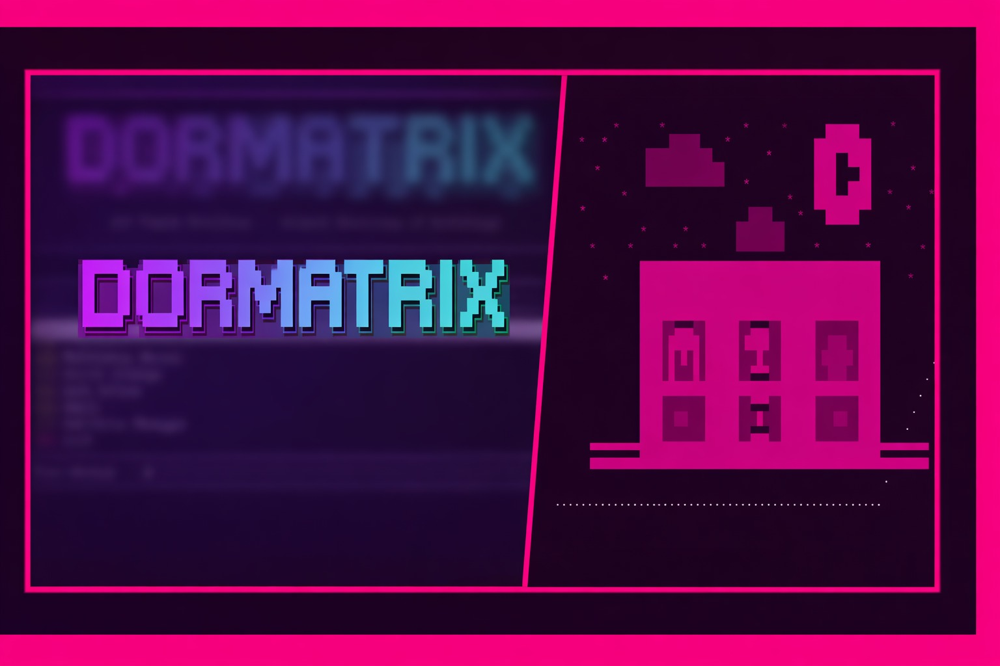
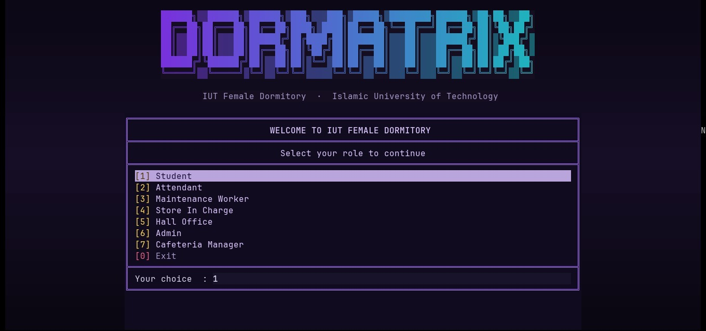
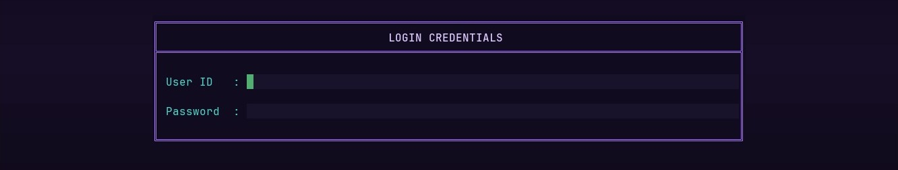
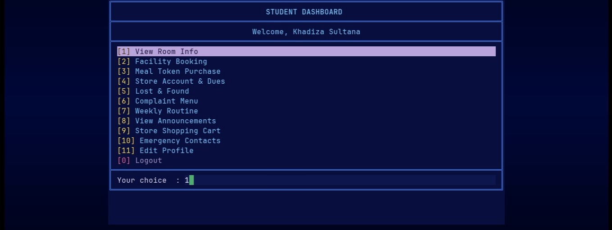
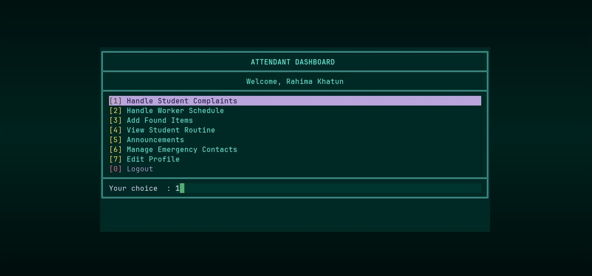
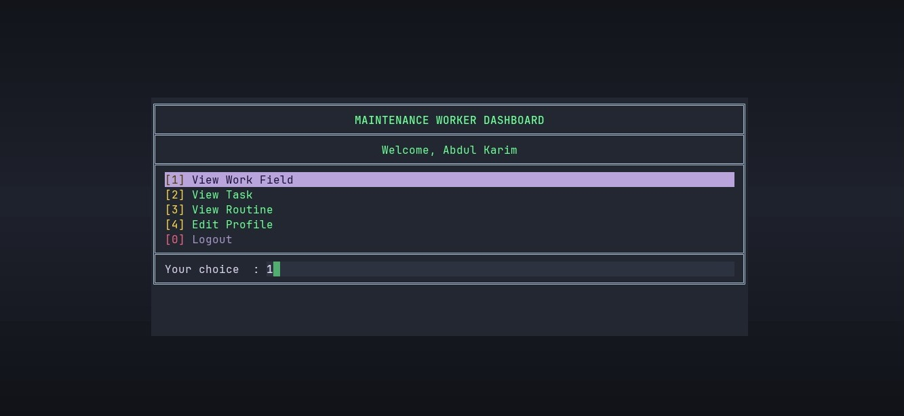
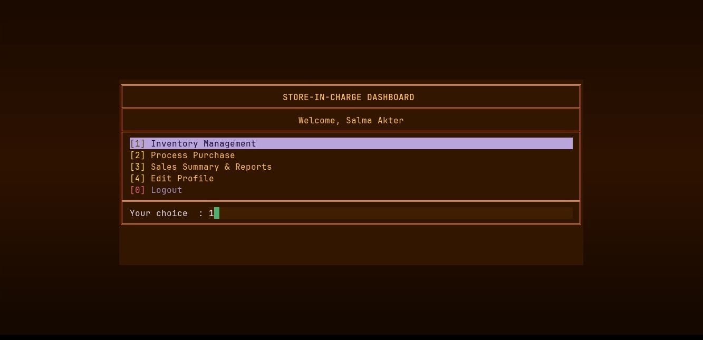
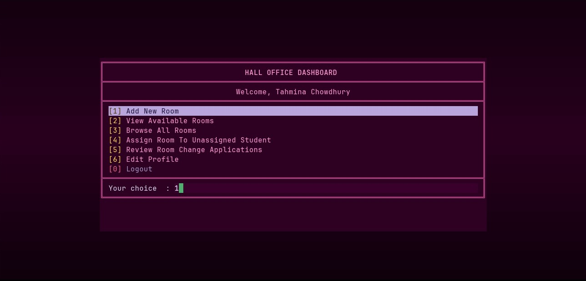
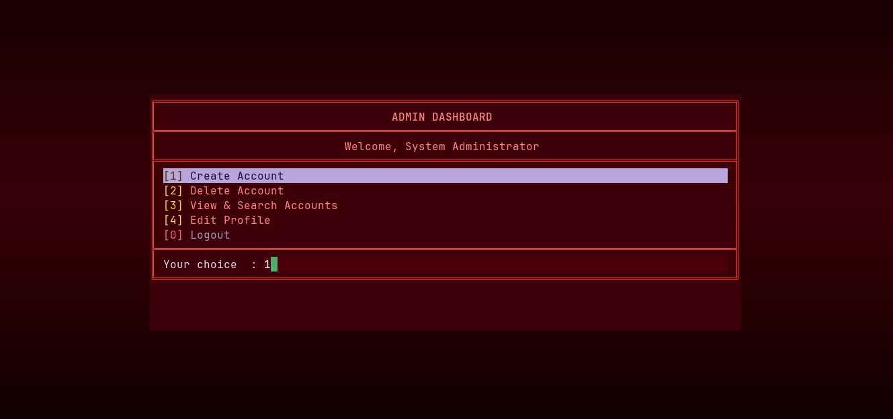
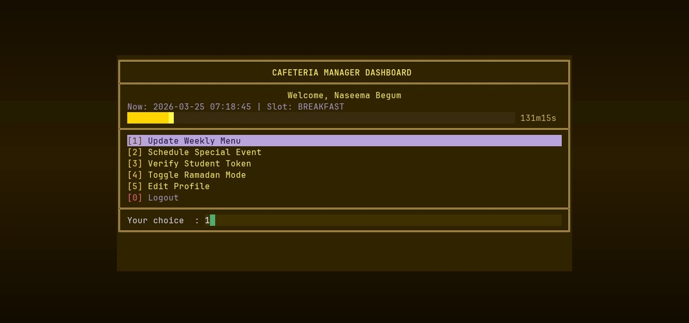

<div align="center">

<br>

<pre>
██████╗▒▒██████╗▒██████╗▒███╗▒▒▒███╗▒█████╗▒████████╗██████╗▒██╗██╗▒▒██╗
██╔══██╗██╔═══██╗██╔══██╗████╗▒████║██╔══██╗╚══██╔══╝██╔══██╗██║╚██╗██╔╝
██║▒▒██║██║▒▒▒██║██████╔╝██╔████╔██║███████║▒▒▒██║▒▒▒██████╔╝██║▒╚███╔╝▒
██║▒▒██║██║▒▒▒██║██╔══██╗██║╚██╔╝██║██╔══██║▒▒▒██║▒▒▒██╔══██╗██║▒██╔██╗▒
██████╔╝╚██████╔╝██║▒▒██║██║▒╚═╝▒██║██║▒▒██║▒▒▒██║▒▒▒██║▒▒██║██║██╔╝▒██╗
╚═════╝▒▒╚═════╝▒╚═╝▒▒╚═╝╚═╝▒▒▒▒▒╚═╝╚═╝▒▒╚═╝▒▒▒╚═╝▒▒▒╚═╝▒▒╚═╝╚═╝╚═╝▒▒╚═╝
</pre>

# DORMATRIX

<b>IUT Female Dormitory · Islamic University of Technology</b>

<br>

[](https://www.oracle.com/java/)
[](LICENSE)
[](https://wezfurlong.org/wezterm/)
[](https://www.microsoft.com/windows)
[](#)

<br>

<i>A feature-rich, terminal-based dormitory management system with vivid ANSI true-color UI — built for students, staff, and administrators of the IUT Female Dormitory.</i>

<br>

<a href="#overview">📋 Overview</a> ·
<a href="#demo">🎥 Demo</a> ·
<a href="#walkthrough">🎬 Walkthrough</a> ·
<a href="#features">✨ Features</a> ·
<a href="#libraries">📚 Libraries Used</a> ·
<a href="#installation">⚙️ Installation</a> ·
<a href="#architecture">🏗️ Architecture</a> ·
<a href="#data-storage">💾 Data Storage</a> ·
<a href="#testing">🧪 Testing</a> ·
<a href="#team">👥 Team</a>

</div>

---

<a name="overview"></a>
## 📋 Overview

<table>
<tr>
<td width="64%" valign="top">

**Dormatrix** is a fully-featured dormitory management system. It unifies all dormitory operations — room management, cafeteria services, complaint handling, facility booking, store inventory, lost & found, routines, announcements, and emergency contacts — under a single role-based platform.

Each of the **7 user roles** gets its own **color-themed dashboard**, designed to surface exactly the tools that role needs. The system is built on a clean **MVC + Repository** architecture with file-based persistence — no database setup required.

<br>

[](#)
[](#)
[](#)

</td>
<td width="36%" valign="top" align="center">

<pre>
        *       *            *      *                  *         
  *   *          ▒▒▒▒▒    *                 ██████               
             ▒▒▒▒▒▒▒▒▒▒▒         *        ██████████             
     *       ▒▒▒▒▒▒▒▒▒▒▒▒▒                ████  ████      *      
             ▒▒▒▒▒▒▒▒▒▒▒▒▒   *            ████    ██             
         *                          *     ████  ████  *      *   
  *                           ▒▒▒▒    *   ██████████     *       
            *      *        ▒▒▒▒▒▒▒▒        ██████               
   *     *       *    *     ▒▒▒▒▒▒▒▒     *        *        *     
           ▄▄▄▄▄▄▄▄▄▄▄▄▄▄▄▄▄▄▄▄▄▄▄▄▄▄▄▄▄▄▄▄▄▄▄▄▄▄▄▄▄▄▄▄▄▄▄▄▄             
      *    █████████████████████████████████████████     *       
           █████████████████████████████████████████             
           █████████████████████████████████████████             
           ████▒▒▄▄▄▒▒██████▒▒▄▄▄▒▒██████▒▒▒▒▒▒▒████             
           ████▒█████▒██████▒████▒▒██████▒▒▓▓▓▒▒████             
           ████▒█▒█▒█▒██████▒▒▒█▒▒▒██████▒▓▓▓▓▓▒████             
           ████▒█▒▒▒█▒██████▒▒▀▀▀▒▒██████▒▒▓▓▓▒▒████             
           █████████████████████████████████████████             
           ████▒▒▒▒▒▒▒██████▒▒▀▀▀▒▒██████▒▒▒▒▒▒▒████             
           ████▒▒▓▓▒▒▒██████▒▒▒█▒▒▒██████▒▒▒▓▓▒▒████             
           ████▒▒▒▒▒▒▒██████▒▒▄▄▄▒▒██████▒▒▒▒▒▒▒████             
   ▀▀▀▀▀▀▀▀█████████████████████████████████████████▀▀▀▀▀▀▀▀▀▀   
   ███████████████████████████████████████████████████████████   
</pre>

</td>
</tr>
</table>

---
## 🎭 User Roles

```text
┌──────────────────────────────────────────────────────────┐
│             WELCOME TO IUT FEMALE DORMITORY              │
│               Select your role to continue               │
├──────────────────────────────────────────────────────────┤
│  [1] Student              [5] Hall Office                │
│  [2] Attendant            [6] Admin                      │
│  [3] Maintenance Worker   [7] Cafeteria Manager          │
│  [4] Store In Charge      [0] Exit                       │
└──────────────────────────────────────────────────────────┘
```

| Role | Theme | Options | Primary Focus |
|------|-------|:-------:|---------------|
| Student | Navy Blue | 11 | Room, meals, booking, complaints, store |
| Attendant | Deep Teal | 7 | Complaints, scheduling, announcements |
| Maintenance Worker | Steel Blue / Gray | 4 | Repair and maintenance task resolution |
| Store-in-Charge | Warm Brown / Amber | 4 | Inventory, orders, sales reports |
| Hall Office | Hot Pink / Magenta | 6 | Room management and allocation |
| Admin | Deep Red | 4 | Full system control, account management |
| Cafeteria Manager | Golden Yellow | 5 | Weekly menus, tokens, Ramadan mode |

---

<a name="demo"></a>
## 🎥 Demo

<div align="center">

<a href="#">
  
</a>

<br><br>

<b>Video Demonstration</b><br>
A guided walkthrough of Dormatrix

</div>

---

### How It Works

```
1. Select a role from the entry screen
2. Log in with masked password input (hashed — never stored in plain text)
3. Land on your role's themed dashboard
4. Perform tasks scoped to your role
5. Controllers update records and persist changes to flat text files
6. Other roles see the updated information immediately on their next read
```

Student actions — complaints, bookings, store purchases, meal token requests — become records that surface in the relevant staff dashboard. The system behaves as one connected workflow, not a collection of isolated tools.

---

<a name="walkthrough"></a>
## 🎬 Walkthrough

### Launch & Role Selection



When Dormatrix starts, the screen is filled with the **DORMATRIX** splash header rendered with ANSI true-color escape codes, followed by a matrix rain animation that plays on first entry.

Below the header is the **role selection menu** — the entry point for every session. The currently highlighted option is shown, and navigation works both by typing a number and pressing Enter, as well as arrow keys.

| Input | Role | Dashboard Theme |
|-------|------|----------------|
| `1` | Student | Navy Blue |
| `2` | Attendant | Deep Teal |
| `3` | Maintenance Worker | Steel Blue / Gray |
| `4` | Store In Charge | Warm Brown / Amber |
| `5` | Hall Office | Hot Pink / Magenta |
| `6` | Admin | Deep Red |
| `7` | Cafeteria Manager | Golden Yellow |
| `0` | Exit | — |

---

### Login

<div align="center">
  
  <br><sub><b>Login Screen</b></sub>
</div>

<br>

After selecting a role, the **Login Credentials** panel prompts for a User ID and password. Password input is masked (each character echoed as `•`) using JLine3. The entered password is run through the three-channel `HashFunction` and compared against the stored hash in the correct role file. Incorrect credentials show an error and re-prompt; after three consecutive failed attempts the system drops back to role selection. Successful login loads the role-specific dashboard.


---

### Dashboards

> All dashboards include an **Edit Profile** option for updating contact details or changing the login password.

<details>
<summary><b>Student Dashboard</b> — 11 features</summary>

<br>

<div align="center">
  
  <br><sub><b>Student Dashboard</b></sub>
</div>

<br>

#### `[1]` View Room Info
Displays the student's current room — number, floor, section, capacity, and a list of current roommates by name and ID. New students are initially marked `UNASSIGNED` until the Hall Office allocates a room. Students can also submit a room-change application from here.

#### `[2]` Facility Booking
Reserve three types of shared facilities:
- **Laundry** — 6 machines. One active booking per student. The machine auto-releases after the wash cycle completes via a background timer.
- **Study Room** — a **6-slot × 10-seat** grid. Each seat within a slot is held by one student only; a student cannot hold more than one seat per slot.
- **Fridge** — **10 personal slots** allocated using the **First-Free Memory algorithm**. Booking is rejected when all 10 are occupied.

#### `[3]` Meal Token Purchase
Purchase meal tokens for the cafeteria. Tokens cannot be bought outside a meal's service window. Tokens carry a status: `ACTIVE`, `USED`, or `EXPIRED`. Meal times automatically switch when Ramadan mode is enabled by the Cafeteria Manager.

| Mode | Meal | Window |
|------|------|--------|
| Normal | Breakfast | 07:00 – 09:30 (10:00 on weekends) |
| Normal | Lunch | 12:00 – 14:00 |
| Normal | Dinner | 19:00 – 21:00 |
| Ramadan | Suhoor | 03:00 – 04:30 |
| Ramadan | Iftar | 18:00 – 19:15 |
| Ramadan | Dinner | 19:30 – 21:30 |

#### `[4]` Store Account & Dues
View the full store account — current balance, itemized transaction history, and any outstanding dues.

#### `[5]` Lost & Found
Report a lost item with description, category, and last known location — or browse the found items list to claim something. Items are logged with timestamps and a `CLAIMED` / `UNCLAIMED` status.

#### `[6]` Complaint Menu
Submit a complaint under one of four categories: **Electricity, Plumbing, Internet, or Cleaning**. The system automatically detects emergency keywords, assigns priority, and routes to the appropriate worker. Previously submitted complaints can be tracked by ID. An optional scheduling note can be attached.

#### `[7]` Weekly Routine
View and manage your personal weekly schedule — class timings, activities, or any custom entries. Complaint visit markers appear directly inside the routine and are cleared automatically on resolution.

#### `[8]` View Announcements
Read official notices posted by the Hall Office or Attendants, ordered most-recent first.

#### `[9]` Store Shopping Cart
Browse available store items, add them to a cart, and confirm the purchase. Orders are billed to the student's store account. Purchases proceed even with insufficient balance — the shortfall is recorded as due.

#### `[10]` Emergency Contacts
View dormitory emergency contacts — on-duty warden, campus medical, security desk — and manage your own personal emergency contact entries.

<br>

</details>

<details>
<summary><b>Attendant Dashboard</b> — 7 features</summary>

<br>

<div align="center">
  
  <br><sub><b>Attendant Dashboard</b></sub>
</div>

<br>

#### `[1]` Handle Student Complaints
View all submitted complaints, grouped by priority — `EMERGENCY` entries always appear first. Update status, add resolution notes, and assign to the appropriate maintenance worker.

#### `[2]` Handle Worker Schedule
Assign and manage the weekly shifts of maintenance workers and cleaning staff.

#### `[3]` Add Found Items
Log newly found items into the Lost & Found system — description, location, date, and status.

#### `[4]` View Student Routine
Browse the weekly routines of all students — useful for planning inspections without disrupting class timetables.

#### `[5]` Announcements
Create, edit, retract, and archive hall-wide announcements.

#### `[6]` Manage Emergency Contacts
Add, update, or remove the official emergency contacts shown on every student's dashboard.

<br>

</details>

<details>
<summary><b>Maintenance Worker Dashboard</b> — 4 features</summary>

<br>

<div align="center">
  
  <br><sub><b>Maintenance Worker Dashboard</b></sub>
</div>

<br>

#### `[1]` View Work Field
Displays the worker's assigned specialization:

| Specialization | Responsibilities |
|---|---|
| Electrician | Electrical faults, wiring, and power issues |
| Plumber | Plumbing, water leaks, and pipe issues |
| Internet Tech | Connectivity and network issues |
| Cleaning | Cleaning and sanitation of dorm facilities |

#### `[2]` View Task
View all complaints assigned to this worker — with priority level, category, student name, room number, and current status. Workers can update status to `IN_PROGRESS` or `RESOLVED`.

#### `[3]` View Schedule
View the worker's confirmed visit schedule for the week, each entry linked to its complaint record.

<br>

</details>
<details>
<summary><b>Store-in-Charge Dashboard</b> — 4 features</summary>

<br>

<div align="center">
  
  <br><sub><b>Store-in-Charge Dashboard</b></sub>
</div>

<br>

#### `[1]` Inventory Management
View the full item catalog with stock levels. Add products, restock, update prices, or flag items as out of stock.

#### `[2]` Process Purchase
Review and fulfill pending student orders. Confirm orders, deduct inventory, and bill the student's account.

#### `[3]` Sales Summary & Reports
View daily and weekly totals, most purchased items, revenue summaries, and low-stock alerts.

<br>

</details>

<details>
<summary><b>Hall Office Dashboard</b> — 6 features</summary>

<br>

<div align="center">
  
  <br><sub><b>Hall Office Dashboard</b></sub>
</div>

<br>

#### `[1]` Add New Room
Register a new room — set the room number and capacity.

#### `[2]` View Available Rooms
Real-time list of all rooms with open slots, showing occupancy status (`AVAILABLE` / `FULL`).

#### `[3]` Browse All Rooms
Full catalog of every room including occupied ones, with current occupancy counts and capacity details.

#### `[4]` Assign Room To Unassigned Student
Look up a student by ID or name and assign them a room. Only works for students currently marked `UNASSIGNED`.

#### `[5]` Review Room Change Applications
View, approve, or reject room change requests. On approval, old and new room occupancy counts update in a single operation. Applications follow the lifecycle: `PENDING → COMPLETED / REJECTED`.

<br>

</details>

<details>
<summary><b>Admin Dashboard</b> — 4 features</summary>

<br>

<div align="center">
  
  <br><sub><b>Admin Dashboard</b></sub>
</div>

<br>

#### `[1]` Create Account
Create accounts for any role. Input is validated with custom exceptions:

| Exception | Trigger |
|-----------|---------|
| `InvalidEmailException` | Malformed email address |
| `InvalidPhoneException` | Invalid phone number format |
| `InvalidDepartmentException` | Unrecognized department |
| `InvalidPasswordException` | Password does not meet requirements |
| `UserAlreadyExistsException` | ID already registered |

#### `[2]` Delete Account
Remove a user account by ID, with confirmation step.

#### `[3]` View & Search Accounts
Browse all registered users across roles, or search by name or ID — spans all role files at once.

<br>

</details>

<details>
<summary><b>Cafeteria Manager Dashboard</b> — 5 features</summary>

<br>

<div align="center">
  
  <br><sub><b>Cafeteria Manager Dashboard</b></sub>
</div>

<br>

The dashboard includes a live, animated **meal slot progress bar** showing the current meal window and remaining time.

#### `[1]` Update Weekly Menu
Set or update the weekly meal menu for each day and meal type, for both normal and Ramadan modes.

#### `[2]` Schedule Special Event
Plan special cafeteria events or custom meal days outside the standard weekly menu.

#### `[3]` Verify Student Token
Manually verify a meal token by ID — confirms whether it is `ACTIVE`, `USED`, or `EXPIRED`. Marks it `USED` if still active.

#### `[4]` Toggle Ramadan Mode
Switch the entire food system between normal and Ramadan meal times with one toggle. The change persists immediately across restarts.

<br>

</details>

---

<a name="features"></a>
## ✨ Features

<details>
<summary><b>Smart Complaint Engine</b> — auto-priority, auto-routing, keyword detection</summary>

<br>

Complaints are evaluated against a layered keyword set at submission time — no manual flagging needed.

**General triggers:** `fire` · `smoke` · `burning` · `sparks` · `electric shock` · `flood` · `burst pipe` · `overflow` · `danger` · `panic`

**Category-specific extras:**

| Category | Additional triggers |
|----------|-------------------|
| Electricity | short circuit · burning smell · shock |
| Plumbing | burst · flood · sewage · blocked main |

A match instantly sets priority to `EMERGENCY`. Without a match it defaults to `NORMAL`. Either way the complaint is routed to the correct worker field automatically:

```
ELECTRICITY → ELECTRICIAN   PLUMBING → PLUMBER
INTERNET    → INTERNET_TECH  CLEANING → CLEANING
```

Lifecycle: `SUBMITTED → ASSIGNED → IN_PROGRESS → RESOLVED`

<br>

</details>

<details>
<summary><b>Complaint ↔ Schedule Integration</b> — closed-loop visit planning</summary>

<br>

Complaints drive real scheduling. Once an attendant assigns a worker, the system checks both the worker's calendar and the student's routine before confirming a visit slot — busy slots are skipped automatically, only upcoming ones are considered.

Confirmed visits are **injected directly into the student's routine** as markers. If the complaint is resolved, the entry is cleared automatically. Students can attach scheduling preference notes to a complaint; these appear as badge labels on the attendant's review screen.

```
1. Student submits → policy sets priority + worker field
2. Attendant assigns worker → complaint enters scheduling queue
3. Scheduler checks availability on both sides → valid slot selected
4. Visit saved → worker schedule + student routine both updated
5. Complaint resolved → routine entry cleared automatically
```

<br>

</details>

<details>
<summary><b>Time-Aware Cafeteria System</b> — time-gated tokens, Ramadan mode, demo clock</summary>

<br>

Token purchases are locked outside valid meal windows. Duplicate purchase for the same meal type on the same day is also blocked.

| Mode | Meal | Window |
|------|------|--------|
| Normal | Breakfast | 07:00 – 09:30 (10:00 on weekends) |
| Normal | Lunch | 12:00 – 14:00 |
| Normal | Dinner | 19:00 – 21:00 |
| Ramadan | Suhoor | 03:00 – 04:30 |
| Ramadan | Iftar | 18:00 – 19:15 |
| Ramadan | Dinner | 19:30 – 21:30 |

**Demo mode** compresses the full 07:00–22:00 day into 20 real minutes (45 simulated seconds per real second) so all three meal windows open and close within a single session. Switching to a live deployment requires one line: `TimeManager.setDemoMode(false)`.

**Ramadan mode** is toggled by the Cafeteria Manager and persists across restarts via `data/foods/config.txt`.

Tokens carry one of three statuses: `ACTIVE`, `USED`, `EXPIRED`. The Cafeteria Manager verifies by token ID, marking it `USED` if still active.

<br>

</details>

<details>
<summary><b>Facility Booking — Three Distinct Algorithms</b></summary>

<br>

Each shared facility uses a different allocation strategy:

**Laundry — Timer-Based Auto-Release**
One active booking per student. On booking, a background daemon timer fires after exactly 120 seconds to simulate wash cycle completion. Before releasing, a safety check confirms the occupant hasn't changed between booking and expiry. Every release is logged via `Logger` and persisted immediately.

**Study Room — Stopwatch Cycle Clock**
Six two-hour windows (08–20) are compressed to a 12-minute demo cycle — 2 real minutes per slot. The current slot index is computed live from the system clock:
```
slotIndex = (totalSecondsInHour % 720) / 120
```
Seats release automatically when the window ends. One seat per student per slot; a `SlotUnavailableException` is thrown when a slot is full.

**Fridge — First-Fit Allocation**
Ten compartments assigned automatically by `FirstFitAllocator` — lowest-numbered free slot wins. No cherry-picking; sequential assignment keeps it fair. Throws `SlotUnavailableException` when all 10 are occupied.

<br>

</details>

<details>
<summary><b>Store Credit & Due System</b> — purchases never blocked, shortfall logged as due</summary>

<br>

Students browse inventory, build a cart, and check out even with insufficient balance. The shortfall is appended to `data/store/dues.txt` and the order goes through regardless. Every completed purchase writes an itemized record to `data/store/sales.txt` and updates the balance file immediately — no batching or delay. Zero-stock items appear as unavailable in the inventory view. The Store-in-Charge can review all outstanding dues and full sales history from the staff dashboard at any time.

<br>

</details>

<details>
<summary><b>Room Management</b> — assignments, room changes, occupancy tracking</summary>

<br>

Students view their full room details (number, floor, section, capacity, roommates by name and ID) and submit room-change applications from the dashboard. Applications follow a `PENDING → COMPLETED / REJECTED` lifecycle managed by the Hall Office. On approval, the old room's occupancy decrements and the new room's increments in a single atomic operation. Unassigned students are surfaced explicitly in the Hall Office assignment screen — adding a room never auto-assigns anyone.

<br>

</details>

<details>
<summary><b>Three-Channel Password Hashing</b> — custom DJB2 + XOR scheme</summary>

<br>

Passwords are hashed by `HashFunction` before being written to disk. Three independent channels combine into a single 8-character hex digest:

| Channel | Algorithm | Purpose |
|---------|-----------|---------|
| 1 | DJB2 polynomial — `hash * 33 ⊕ c` | Cascading avalanche across all bit positions |
| 2 | XOR-then-multiply — `(hash ⊕ c) × 31` | Breaks linear relationships between adjacent characters |
| 3 | Position-sensitive XOR — `c << (i % 16)` | Makes the hash sensitive to character order independently |

All three are XOR-combined and masked to a positive integer. Plain-text passwords are never written to disk and are discarded from memory immediately after comparison.

<br>

</details>

<details>
<summary><b>Custom-Built Libraries</b> — no Java collections used in core logic</summary>

<br>

All collection and utility needs are served by internal classes built from scratch:

| Library | Class | Purpose |
|---------|-------|---------|
| `libraries/collections` | `MyArrayList<T>` | Full dynamic-resizing list re-implementation |
| `libraries/collections` | `MyString` | String wrapper — `split`, `toLowerCase`, `containsAny`, `replace`, `intToHex` |
| `libraries/collections` | `MyOptional<T>` | Safe null-handling wrapper |
| `libraries/hashing` | `HashFunction` | Three-channel DJB2 + XOR password hashing |
| `libraries/slots` | `SlotAllocator` | Abstract base with stopwatch cycle-clock logic |
| `libraries/slots` | `FirstFitAllocator` | First-fit allocation (fridge booking) |
| `libraries/slots` | `LastFitAllocator` | Last-fit allocation utility |
| `libraries/file` | `TextFile` | File read/write abstraction |
| `libraries/logs` | `Logger` | Audit-trail logging for bookings and auto-release events |

<br>

</details>

<details>
<summary><b>UI Highlights</b></summary>

<br>

- **7 distinct ANSI true-color themes** — one per role, applied down to the background fill
- **Matrix rain animation** on first entry to each role's dashboard
- **Live animated progress bar** in the Cafeteria Manager dashboard showing current meal slot and remaining time
- **Arrow key + number navigation** throughout all menus, with a lilac highlight bar on the active item
- **Dynamic terminal sizing** — panels reflow to the current window width; layout adapts automatically

<br>

</details>

---

<a name="libraries"></a>
## 📚 Libraries Used

Dormatrix was deliberately built with minimal external dependencies. Almost everything — data structures, hashing, file I/O helpers, slot allocation, and terminal rendering — was implemented from scratch as part of the project.

### External Libraries

These are the only third-party libraries the project depends on:

| Library | Type | Version | Purpose |
|---------|------|---------|---------|
| **JLine3** | External JAR | Latest stable | Masked password input during login — hides each character behind a `•` bullet so credentials never appear on screen. This is the **only** runtime dependency beyond the JDK. |
| **JUnit 5** | Testing framework | 5.x | Unit testing during development and verification. Used exclusively in the `tests/` package and not bundled in the production build. |

---

### Custom-Built Libraries (`libraries/` package)

Rather than pulling in utility libraries, the team built and used a set of internal classes throughout the codebase. These are not placeholder stubs — every class listed below is actively used in production code.

#### Collections (`libraries/collections`)

| Class | What it does |
|-------|-------------|
| `MyArrayList<T>` | A full dynamic-resizing list built from a raw array. Supports `add`, `get`, `set`, `remove`, `contains`, `indexOf`, `clear`, `forEach`, and automatic capacity doubling. Used in place of `java.util.ArrayList` across the project. |
| `MyString` | A character-array string wrapper with its own `split`, `trim`, `toLowerCase`, `toUpperCase`, `containsAny`, `replace`, `substring`, `concat`, and `intToHex` methods. Powers the complaint keyword detection engine and the hash output formatter. |
| `MyOptional<T>` | A minimal optional wrapper that eliminates direct null checks. Provides `of`, `ofNullable`, `isPresent`, `get`, and `orElse`. |

#### Hashing (`libraries/hashing`)

| Class | What it does |
|-------|-------------|
| `HashFunction` | Implements a three-channel password hashing scheme combining DJB2 polynomial mixing (Channel 1), XOR-then-multiply (Channel 2), and position-sensitive bit-shifting (Channel 3). Outputs a fixed 8-character hexadecimal digest via `MyString.intToHex()`. Plain-text passwords are never persisted anywhere in the system. |

#### Slot Allocation (`libraries/slots`)

| Class | What it does |
|-------|-------------|
| `SlotAllocator` | Abstract base class that defines the slot allocation contract. Also contains the stopwatch-style **cycle clock** used by the study room: a 12-minute repeating cycle mapped to 6 two-minute booking windows, computed live from the real system clock. |
| `FirstFitAllocator` | Scans the slot array linearly and returns the index of the first `null` (free) entry. Used for fridge compartment assignment — the lowest-numbered available slot always wins, keeping distribution sequential and fair. |
| `LastFitAllocator` | Returns the last available slot in the array. Built as a complementary allocation strategy alongside first-fit. |

#### File Utilities (`libraries/file`)

| Class | What it does |
|-------|-------------|
| `FilePaths` | Centralizes all file path constants so no path string is hard-coded across the codebase. One change here updates every module that reads or writes that file. |
| `TextFile` | Wraps common file operations — read all lines, write all lines, append a line — so repository classes stay concise and the raw `java.io` boilerplate stays in one place. |

#### Logging (`libraries/logs`)

| Class | What it does |
|-------|-------------|
| `Logger` | Writes timestamped audit-trail entries for significant system events (laundry slot auto-release, booking confirmations, etc.). Keeps operational history separate from the user-facing data files. |

---

### Custom Utils (`utils/` package)

Shared rendering, input, time, and role-mapping helpers consumed across multiple modules. Unlike the `libraries/` package — which provides reusable data structures and algorithms — `utils` classes focus on terminal presentation and cross-cutting runtime services. All classes here are actively referenced by more than one module.

<details>
<summary><b>View all utils classes</b></summary>

<br>

| Class | What it does |
|-------|-------------|
| `ConsoleUtil` | Low-level ANSI terminal primitives — screen clearing, cursor movement, cursor hide/show, color reset, and text wrapping for long messages. Used by virtually every screen in the system. |
| `ConsoleColors` | ANSI true-color escape code constants used by the theming system across all seven role dashboards. Centralizing these here means color changes propagate everywhere without touching individual screens. |
| `TerminalUI` | Builds the bordered boxes, aligned headers, and structured column layouts that form the visible skeleton of every dashboard screen. |
| `TerminalUIExtras` | Adds layered visual effects on top of `TerminalUI`, including the matrix-rain animation shown once on first entry to each role's dashboard. |
| `BackgroundFiller` | Fills the entire terminal background with the active role's theme color so each dashboard feels visually distinct at a glance — the background switches on login and clears on logout. |
| `InputHelper` | Handles password reading and wraps keyboard input for secure, consistent form entry across all login and profile-change flows. |
| `FastInput` | Simplifies and standardizes the general input flow throughout the application; also powers arrow-key navigation in the menu system. |
| `RoleMapper` | Normalizes role name variants (e.g. `"Hall Office"`, `"hall_office"`, `"HallOffice"`) into one canonical form so file lookups and dashboard routing stay reliable regardless of how the role string arrives. |
| `CafeteriaAsciiUI` | Renders the live animated progress bar in the Cafeteria Manager dashboard, reflecting the current meal window and time remaining based on `TimeManager`. |
| `TimeManager` | Shared clock service used by the cafeteria, scheduling, and routine modules. Supports three modes: **real** (delegates to `LocalTime.now()`), **demo** (45× time compression — 20 real minutes covers the full 07:00–22:00 simulated day), and **Ramadan** (replaces all standard meal windows with Suhoor, Iftar, and Ramadan Dinner). The Ramadan toggle is persisted to `data/foods/config.txt` and survives application restarts. |
| `FeaturePaths` | Supplementary path constants for feature-specific file lookups, keeping path strings out of individual controller classes and complementing `FilePaths` in the `libraries/file` package. |

<br>

</details>

---

### Standard Java APIs Used

No external libraries are needed for the following — only the JDK:

| API | Where it is used |
|-----|-----------------|
| `java.io` | All file reading and writing through `TextFile` and the repository layer |
| `java.time` (`LocalTime`, `Duration`) | Cafeteria meal-window checks, study room cycle clock, demo clock scaling |
| `java.util.Scanner` | Terminal input across all menu forms |
| `java.util.Timer` + `TimerTask` | Background daemon timer for laundry slot auto-release after 120 seconds |

---

<a name="installation"></a>
## ⚙️ Installation

### Prerequisites

| Requirement | Version | Link |
|-------------|---------|------|
| Java JDK | 17 or higher | [Download](https://www.oracle.com/java/technologies/downloads/) |
| WezTerm | Latest stable | [Download](https://wezfurlong.org/wezterm/) |

> Standard **Windows Command Prompt** and **PowerShell** are not supported. Use **WezTerm** or Windows Terminal with VT processing enabled.

### Setup

```bash
# 1. Clone the repository
git clone https://github.com/tayma-06/Dormatrix.git
cd Dormatrix/code

# 2. First-time build and run
setup.bat

# 3. Subsequent runs
run.bat
```

### Default Admin Credentials

```
User ID  :  admin
Password :  admin123
```

> Change the admin password after first login in any real deployment.

<details>
<summary><b>Troubleshooting</b></summary>

<br>

| Problem | Fix |
|---------|-----|
| Colors not rendering | Ensure WezTerm or Windows Terminal with VT processing is enabled |
| `jline` not found on startup | Confirm `lib/jline3.jar` is present and re-run `setup.bat` |
| `java: command not found` | Check that `JAVA_HOME` is set and JDK 17+ is on your PATH |
| Blank or broken screen on launch | Terminal window too small — resize to at least 120×40 characters |

<br>

</details>

---

<a name="architecture"></a>
## 🏗️ Architecture

Dormatrix uses a clean **MVC + Repository** layered architecture. The CLI screens are the view layer. Controllers handle all business logic. Repositories read from and write to text files. Models hold the domain objects used across the system. This separation means adding a feature always has a clear home — view, logic, and storage stay independent.

```
┌──────────────────────────────────────────────────────────────┐
│                       CLI Layer (View)                       │
│    Dashboards · Forms · Views · Complaint/Routine Screens    │
└───────────────────────────┬──────────────────────────────────┘
                            │
┌───────────────────────────▼──────────────────────────────────┐
│                 Controllers (Business Logic)                 │
│   Auth · Room · Food · Store · Complaint · Facilities ·      │
│   Scheduling · Balance · Announcements · Profile             │
└───────────────────────────┬──────────────────────────────────┘
                            │
┌───────────────────────────▼──────────────────────────────────┐
│               Repositories (Data Access)                     │
│         File-based flat-file persistence layer               │
└───────────────────────────┬──────────────────────────────────┘
                            │
┌───────────────────────────▼──────────────────────────────────┐
│                     Models (Entities)                        │
│   Users · Rooms · Food · Complaints · Store · Facilities ·   │
│   Tokens · Routines · Announcements · Contacts               │
└──────────────────────────────────────────────────────────────┘
```

### Package Overview

| Package | Role |
|---------|------|
| `cli` | All user-facing dashboards, forms, and screen-specific interaction classes, organized by feature area |
| `controllers` | Business logic for every major operation: auth, rooms, food, store, complaints, scheduling, balance, and more |
| `models` | Domain entities and enumerations representing dormitory state |
| `repo` | File-backed persistence classes that read and write structured records for each domain |
| `libraries` | Custom data structures, hashing, file helpers, logging, and slot allocation |
| `exceptions` | Domain-specific exception classes for input validation and operational error conditions |
| `utils` | Shared rendering helpers for ANSI color, terminal sizing, input handling, time management, and role mapping |
| `module` | Additional service layer for complaint policy logic, kept separate from the controller |
| `tests` | JUnit-based test suites covering core logic, custom libraries, UI utilities, and persistence behavior |

<details>
<summary><b>View full project structure</b></summary>

<br>

```
Dormatrix/code/
├── src/
│   ├── Dormatrix.java
│   ├── cli/
│   │   ├── announcement/
│   │   ├── complaint/
│   │   ├── contacts/
│   │   ├── dashboard/
│   │   │   ├── food/
│   │   │   └── room/
│   │   ├── forms/
│   │   ├── profile/
│   │   ├── routine/
│   │   ├── schedule/
│   │   └── views/
│   ├── controllers/
│   │   ├── account/
│   │   ├── announcement/
│   │   ├── authentication/
│   │   ├── balance/
│   │   ├── complaint/
│   │   ├── contacts/
│   │   ├── dashboard/
│   │   ├── facilities/
│   │   ├── food/
│   │   ├── miscellaneous/
│   │   ├── profile/
│   │   ├── room/
│   │   ├── routine/
│   │   ├── schedule/
│   │   └── store/
│   ├── exceptions/
│   │   ├── account/
│   │   ├── config/
│   │   ├── food/
│   │   ├── InsufficientInventoryException.java
│   │   ├── InvalidChoiceException.java
│   │   └── SlotUnavailableException.java
│   ├── libraries/
│   │   ├── collections/
│   │   │   ├── MyArrayList.java
│   │   │   ├── MyOptional.java
│   │   │   └── MyString.java
│   │   ├── file/
│   │   │   ├── FilePaths.java
│   │   │   └── TextFile.java
│   │   ├── hashing/
│   │   │   └── HashFunction.java
│   │   ├── logs/
│   │   │   └── Logger.java
│   │   └── slots/
│   │       ├── FirstFitAllocator.java
│   │       ├── LastFitAllocator.java
│   │       └── SlotAllocator.java
│   ├── models/
│   │   ├── announcements/
│   │   ├── complaints/
│   │   ├── contacts/
│   │   ├── enums/
│   │   ├── facilities/
│   │   ├── food/
│   │   ├── miscellaneous/
│   │   ├── room/
│   │   ├── routine/
│   │   ├── schedule/
│   │   ├── store/
│   │   └── users/
│   ├── module/
│   │   └── complaint/
│   ├── repo/
│   │   └── file/
│   ├── tests/
│   │   ├── TerminalUITest.java
│   │   └── UnitTests.java
│   ├── themes.json
│   └── utils/
│       ├── BackgroundFiller.java
│       ├── CafeteriaAsciiUI.java
│       ├── ConsoleColors.java
│       ├── ConsoleUtil.java
│       ├── FastInput.java
│       ├── FeaturePaths.java
│       ├── InputHelper.java
│       ├── RoleMapper.java
│       ├── TerminalUI.java
│       ├── TerminalUIExtras.java
│       └── TimeManager.java
├── data/
│   ├── users/
│   ├── complaints/
│   ├── routines/
│   ├── schedules/
│   ├── announcements/
│   ├── contacts/
│   ├── facility/
│   └── foods/
├── config/
├── lib/
├── assets/
├── setup.bat
└── run.bat
```

</details>

---

<a name="data-storage"></a>
## 💾 Data Storage

All state is persisted in pipe-delimited (`|`) plain-text files grouped under `data/` by domain. Each repository class handles exactly one file type — adding a field to a record means modifying the model and its corresponding repository only. Every file is human-readable and can be inspected or edited directly; changes take effect on the next application read.

<details>
<summary><b>View all data files</b></summary>

<br>

| File | Contents |
|------|----------|
| `data/users/students.txt` | `ID\|Name\|STUDENT\|Dept\|Hash\|Phone\|Email\|Room` |
| `data/users/admin.txt` | Admin credentials (hashed) |
| `data/users/hall_attendants.txt` | Attendant records |
| `data/users/maintenance_workers.txt` | Worker records with field specialization |
| `data/users/store_in_charges.txt` | Store-in-Charge records |
| `data/users/hall_officers.txt` | Hall Officer records |
| `data/users/cafeteria_managers.txt` | Cafeteria Manager records |
| `data/rooms/rooms.txt` | Room identifiers, capacities, and current occupancy counts |
| `data/rooms/room_change_applications.txt` | Pending and processed room-change applications with status |
| `data/complaints/complaints.txt` | Full complaint stream — category, priority, status, tags, assignment |
| `data/facility/laundrySlots.txt` | Active laundry-slot occupancy records (`slotIndex,studentId`) |
| `data/facility/studyRoomSlots.txt` | Study-room seat booking state per slot and seat index |
| `data/foods/config.txt` | Ramadan mode toggle (`RAMADAN=true/false`), persisted across restarts |
| `data/foods/tokens.txt` | Meal token records with student ID, meal type, timestamp, and status |
| `data/foods/weekly_menu.txt` | Weekly cafeteria menu entries per day, meal type, and Ramadan flag |
| `data/inventories/inventory.txt` | Store product catalog with quantities and prices |
| `data/inventories/balances.txt` | Student stored-value balance records |
| `data/store/dues.txt` | Outstanding student due ledger (`studentId,amount`) |
| `data/store/sales.txt` | Itemized sales history (`studentId,itemId,qty,total,date`) |
| `data/routines/student_routines.txt` | Weekly routine entries per student, including injected complaint visit markers |
| `data/schedules/worker_visits.txt` | Maintenance worker visit scheduling records, complaint-linked |
| `data/announcements/announcements.txt` | Hall notice records with timestamps |
| `data/contacts/emergency_contacts.txt` | Official and personal emergency contact entries |
| `data/lostItems.txt` | Student-submitted lost-item reports with descriptions and timestamps |
| `data/foundItems.txt` | Attendant-logged found-item records with claim status and claimer ID |
| `config/admin.config` | Admin credentials (hashed on first write) |

<br>

</details>

---

<a name="testing"></a>
## 🧪 Testing

Dormatrix includes a **JUnit test suite (300+ tests)** in `src/tests/`. Tests use file snapshotting to isolate each test from real data — every test saves the original file state before running and restores it after completion.

<details>
<summary><b>View full test coverage breakdown</b></summary>

<br>

**Custom Libraries**
- `HashFunction` — determinism, uniqueness, hex output, empty-input edge case, length-sensitivity via channel 3
- `MyArrayList` — add, get, set, remove, contains, indexOf, clear, dynamic resizing, forEach, out-of-bounds throws
- `MyString` — split, concat, trim, case conversion, substring, contains, containsAny, join, replace, intToHex, null constructor, edge-case substrings
- `MyOptional` — present/empty states, `get`, `orElse`, `ofNullable`, throws on null `of` and empty `get`
- `FirstFitAllocator` / `LastFitAllocator` — empty slots, partial occupancy, all-full throws `SlotUnavailableException`

**Authentication & Accounts**
- `CreateAccountController` — valid creation for all roles, invalid email/phone/password/department, duplicate ID
- `DeleteAccountController` — invalid role, wrong admin password, successful deletion, user-not-found
- `SearchUserController` — blank input, search by ID across all role files, trim-before-search, not-found returns null
- `AccountManager` — filename mapping, `userExists`, `registerUser`, `deleteUser`, `findUserDetails` across files

**Models & Serialization**
- `Student`, `Room`, `Item`, `DueRecord`, `StudentBalance`, `CartItem`, `ShoppingCart`, `MealToken`, `DailyMenu`, `RoutineEntry`, `MaintenanceWorker`, `HallOfficer`, `CafeteriaManager`, `StoreInCharge` — construction, getters, `toFileString` / `fromString` round-trips

**Facility Slot Booking**
- **Laundry** — slot conflict prevention, duplicate booking detection, out-of-range slot index rejection
- **Study Room** — seat conflict, student-already-booked detection, invalid seat number rejection
- **Fridge** — all-slots-full throws `SlotUnavailableException`, partial occupancy returns correct first-fit index
- **Room** — full-room allocation blocked, occupancy caps at capacity, decrement floors at zero

**Store System**
- `DueController` — missing student returns 0, `addDue` accumulates, `payDue` removes entry correctly
- `InventoryController` — add, duplicate, update, delete, restock, case-insensitive search, price range filter, low-stock threshold
- `PurchaseController` — insufficient stock returns false, credit purchase deducts inventory and records due and sale
- `PurchaseHistoryController` — filters by student, recent-days filter, totals correct
- `SalesSummaryController` — daily summary, custom date range, revenue and average correct

**Room Management**
- `RoomController` — add room persists, allocate increments occupancy, free decrements, full room returns false
- `RoomService` — resolve student by ID or name, change room (null/blank/same/full/missing all return false), successful move updates student file and occupancy counts
- Room change application lifecycle — submit, block second pending, approve, reject

**Complaint Engine**
- `ComplaintPolicy` — normal priority for benign descriptions, `EMERGENCY` for fire/smoke/electric-shock/flood/burst-pipe keywords, correct worker routing for all 4 categories
- `Complaint` — `createNew`, `assignTo` / `clearAssignment` lifecycle, `appendTagNote`, full 4-stage status transition

**Food & Tokens**
- `MealToken` — creation, status lifecycle, past-date auto-expires, serialization round-trip
- Duplicate active token detection, used token cannot be re-verified, expired token blocked

**Routines & Schedules**
- `RoutineController` — slot index bounds validation, `putSlotByStudentId`, `clearSlotByStudentId`, `writeComplaintVisit`
- `WorkerScheduleController` — `isDefaultDutyDay` for all worker fields and days, `manualPlanComplaint` rejects out-of-bounds, `autoPlanComplaint`

**Profile Management**
- `changePassword` — empty/mismatched/too-short/no-digit password rejected
- `updatePhoneNumber` — empty/invalid format rejected

**Terminal UI Helpers**
- `TerminalUITest` covers padding calculation, gradient rendering, theme application, and box-drawing component output — verifying that UI methods produce well-formed ANSI strings

<br>

</details>

---

<a name="license"></a>
## 📄 License

This project is licensed under the **MIT License** — see [LICENSE](LICENSE) for details.

---

<a name="team"></a>
## 👥 Team

**Dormatrix** — SWE4304 SPL-1 Project
CSE Department, Islamic University of Technology, Gazipur, Bangladesh

| Name | Student ID | GitHub |
|------|-----------|--------|
| Procheta Silvie | 230042114 | [@prochetaSilvie](https://github.com/prochetaSilvie) |
| Khadiza Sultana | 230042135 | [@tayma-06](https://github.com/tayma-06) |
| Sayma Tasnim | 230042139 | [@SayTas](https://github.com/SayTas) |
| Ayman Binte Altaf Nondiny | 230042141 | [@aymannondiny](https://github.com/aymannondiny) |

---

<div align="center">

<b><a href="https://github.com/tayma-06/Dormatrix">⭐ GitHub Repository — github.com/tayma-06/Dormatrix</a></b>

</div>
